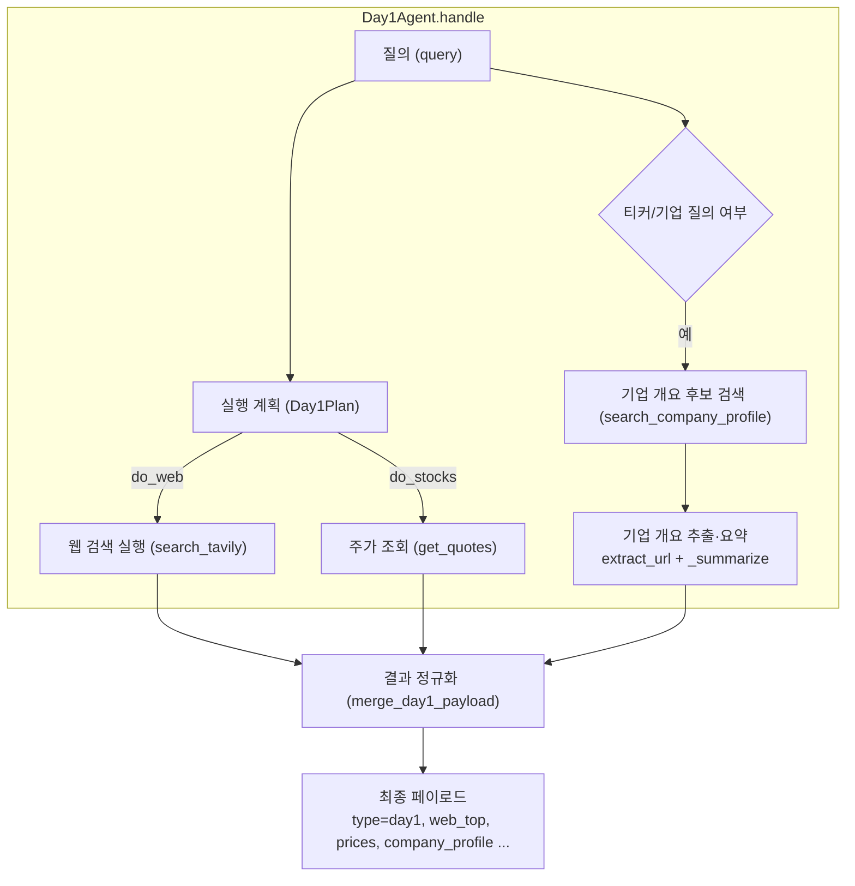

```mermaid
flowchart TD
    subgraph H1["Day1Agent.handle"]
      Q["질의 (query)"] --> P["실행 계획 (Day1Plan)"]
      P -->|do_web| W["웹 검색 실행 (search_tavily)"]
      P -->|do_stocks| S["주가 조회 (get_quotes)"]
      Q --> D{"티커/기업 질의 여부"}
      D -->|예| PS["기업 개요 후보 검색 (search_company_profile)"]
      PS --> EX["기업 개요 추출·요약<br/>extract_url + _summarize"]
    end

    W --> M["결과 정규화 (merge_day1_payload)"]
    S --> M
    EX --> M
    M --> OUT["최종 페이로드<br/>type=day1, web_top, prices, company_profile ..."]

```