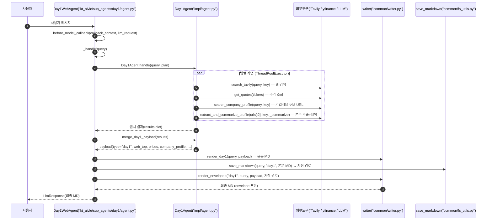

```mermaid
sequenceDiagram
    autonumber
    participant U as 사용자
    participant A as Day1WebAgent("kt_aivle/sub_agents/day1/agent.py")
    participant Impl as Day1Agent("impl/agent.py")
    participant Ext as 외부도구("Tavily / yfinance / LLM")
    participant W as writer("common/writer.py")
    participant FS as save_markdown("common/fs_utils.py")

    U->>A: 사용자 메시지
    A->>A: before_model_callback(callback_context, llm_request)
    A->>A: _handle(query)
    A->>Impl: Day1Agent.handle(query, plan)
    par 병렬 작업 (ThreadPoolExecutor)
        Impl->>Ext: search_tavily(query, key)  — 웹 검색
        Impl->>Ext: get_quotes(tickers)        — 주가 조회
        Impl->>Ext: search_company_profile(query, key) — 기업개요 후보 URL
        Impl->>Ext: extract_and_summarize_profile(urls[:2], key, _summarize) — 본문 추출+요약
    end
    Impl-->>A: 원시 결과(results dict)
    A->>Impl: merge_day1_payload(results)
    Impl-->>A: payload(type="day1", web_top, prices, company_profile, …)
    A->>W: render_day1(query, payload) → 본문 MD
    A->>FS: save_markdown(query, "day1", 본문 MD) → 저장 경로
    A->>W: render_enveloped("day1", query, payload, 저장 경로)
    W-->>A: 최종 MD (envelope 포함)
    A-->>U: LlmResponse(최종 MD)

```