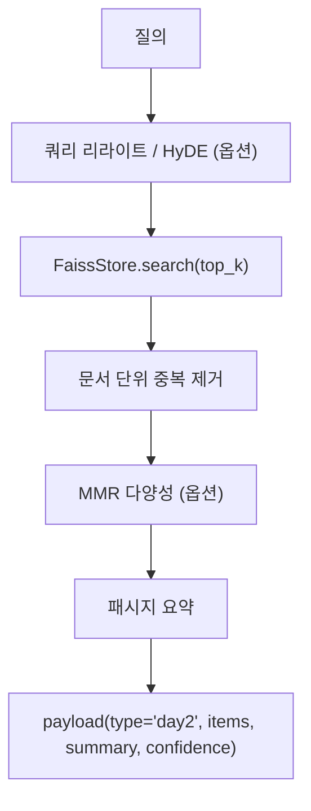

```mermaid
flowchart TD
    Q["질의"]
    RW["쿼리 리라이트 / HyDE (옵션)"]
    RET["FaissStore.search(top_k)"]
    DD["문서 단위 중복 제거"]
    MMR["MMR 다양성 (옵션)"]
    SUM["패시지 요약"]
    OUT["payload(type='day2', items, summary, confidence)"]

    Q --> RW --> RET --> DD --> MMR --> SUM --> OUT
```