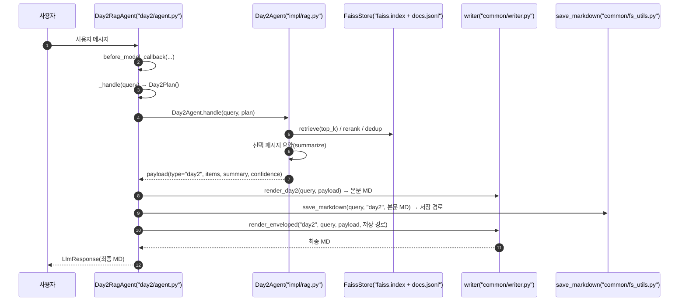

```mermaid
sequenceDiagram
    autonumber
    participant U as 사용자
    participant A as Day2RagAgent("day2/agent.py")
    participant Impl as Day2Agent("impl/rag.py")
    participant IDX as FaissStore("faiss.index + docs.jsonl")
    participant W as writer("common/writer.py")
    participant FS as save_markdown("common/fs_utils.py")

    U->>A: 사용자 메시지
    A->>A: before_model_callback(...)
    A->>A: _handle(query) → Day2Plan()
    A->>Impl: Day2Agent.handle(query, plan)
    Impl->>IDX: retrieve(top_k) / rerank / dedup
    Impl->>Impl: 선택 패시지 요약(summarize)
    Impl-->>A: payload(type="day2", items, summary, confidence)
    A->>W: render_day2(query, payload) → 본문 MD
    A->>FS: save_markdown(query, "day2", 본문 MD) → 저장 경로
    A->>W: render_enveloped("day2", query, payload, 저장 경로)
    W-->>A: 최종 MD
    A-->>U: LlmResponse(최종 MD)

```