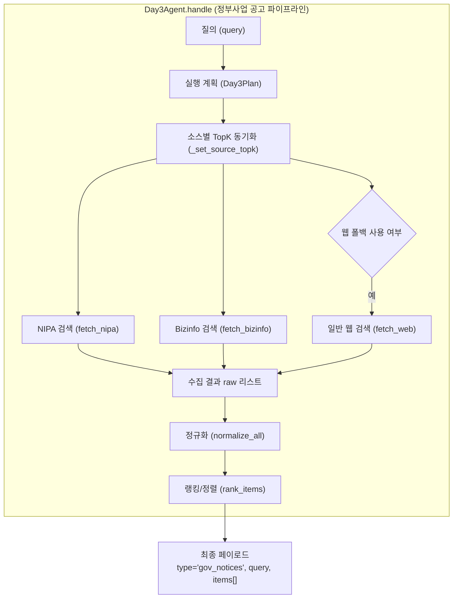

```mermaid
flowchart TD
    subgraph H1["Day3Agent.handle (정부사업 공고 파이프라인)"]
      Q["질의 (query)"] --> P["실행 계획 (Day3Plan)"]
      P --> T["소스별 TopK 동기화 (_set_source_topk)"]

      T --> F1["NIPA 검색 (fetch_nipa)"]
      T --> F2["Bizinfo 검색 (fetch_bizinfo)"]
      T --> C{"웹 폴백 사용 여부"}
      C -->|예| F3["일반 웹 검색 (fetch_web)"]

      F1 --> RAW["수집 결과 raw 리스트"]
      F2 --> RAW
      F3 --> RAW
      RAW --> N["정규화 (normalize_all)"]
      N --> R["랭킹/정렬 (rank_items)"]
    end

    R --> OUT["최종 페이로드<br/>type='gov_notices', query, items[]"]
```