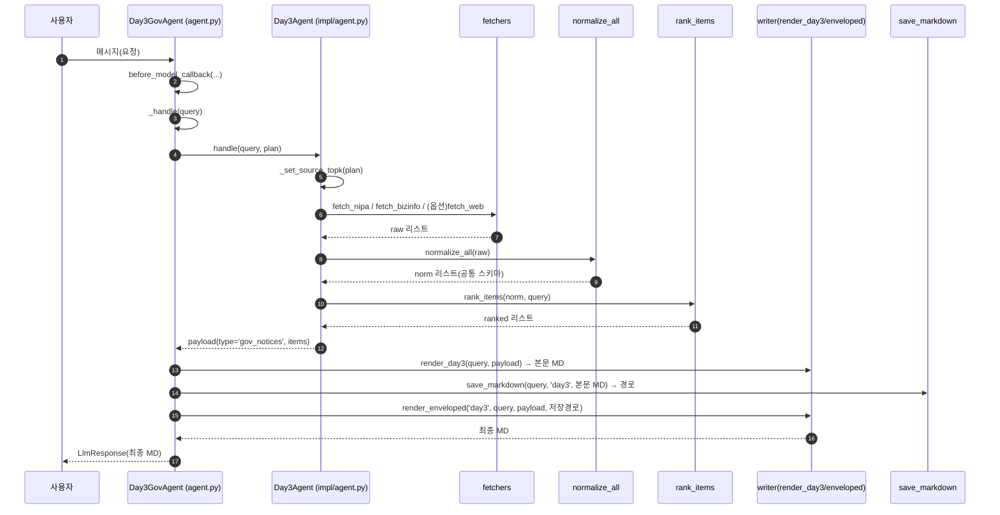

```mermaid
sequenceDiagram
    autonumber
    participant U as 사용자
    participant A as Day3GovAgent (agent.py)
    participant Impl as Day3Agent (impl/agent.py)
    participant F as fetchers
    participant N as normalize_all
    participant R as rank_items
    participant W as writer(render_day3/enveloped)
    participant FS as save_markdown

    U->>A: 메시지(요청)
    A->>A: before_model_callback(...)
    A->>A: _handle(query)
    A->>Impl: handle(query, plan)

    Impl->>Impl: _set_source_topk(plan)
    Impl->>F: fetch_nipa / fetch_bizinfo / (옵션)fetch_web
    F-->>Impl: raw 리스트
    Impl->>N: normalize_all(raw)
    N-->>Impl: norm 리스트(공통 스키마)
    Impl->>R: rank_items(norm, query)
    R-->>Impl: ranked 리스트
    Impl-->>A: payload(type='gov_notices', items)

    A->>W: render_day3(query, payload) → 본문 MD
    A->>FS: save_markdown(query, 'day3', 본문 MD) → 경로
    A->>W: render_enveloped('day3', query, payload, 저장경로)
    W-->>A: 최종 MD
    A-->>U: LlmResponse(최종 MD)
```