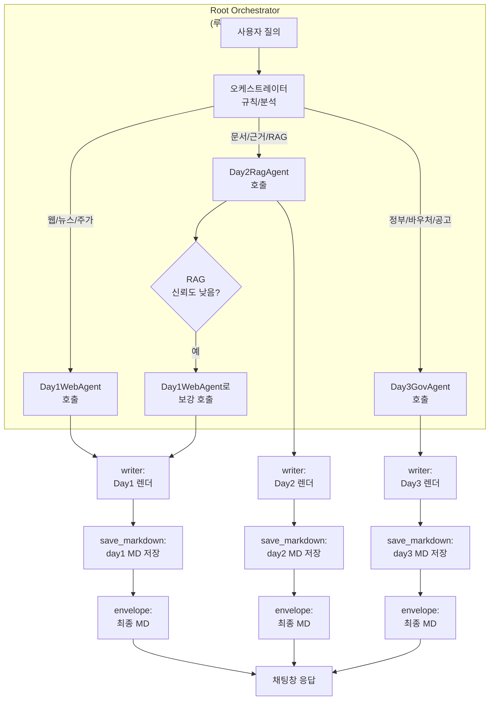

%%{init: {
  "flowchart": {
    "useMaxWidth": false,
    "htmlLabels": true,
    "nodeSpacing": 100,
    "rankSpacing": 40,
    "diagramPadding": 10
  }
}}%
%

```mermaid
flowchart TD
  subgraph R["Root Orchestrator<br/>(루트 에이전트)"]
    U["사용자 질의"] --> I["오케스트레이터<br/>규칙/분석"]
    I -->|정부/바우처/공고| D3["Day3GovAgent<br/>호출"]
    I -->|문서/근거/RAG| D2["Day2RagAgent<br/>호출"]
    I -->|웹/뉴스/주가| D1["Day1WebAgent<br/>호출"]
    D2 --> C{"RAG<br/>신뢰도 낮음?"}
    C -->|예| D1b["Day1WebAgent로<br/>보강 호출"]
  end

  D1 --> W1["writer:<br/>Day1 렌더"]
  D1b --> W1
  D2 --> W2["writer:<br/>Day2 렌더"]
  D3 --> W3["writer:<br/>Day3 렌더"]

  W1 --> S1["save_markdown:<br/>day1 MD 저장"]
  W2 --> S2["save_markdown:<br/>day2 MD 저장"]
  W3 --> S3["save_markdown:<br/>day3 MD 저장"]

  S1 --> E1["envelope:<br/>최종 MD"]
  S2 --> E2["envelope:<br/>최종 MD"]
  S3 --> E3["envelope:<br/>최종 MD"]

  E1 --> RSP["채팅창 응답"]
  E2 --> RSP
  E3 --> RSP

```