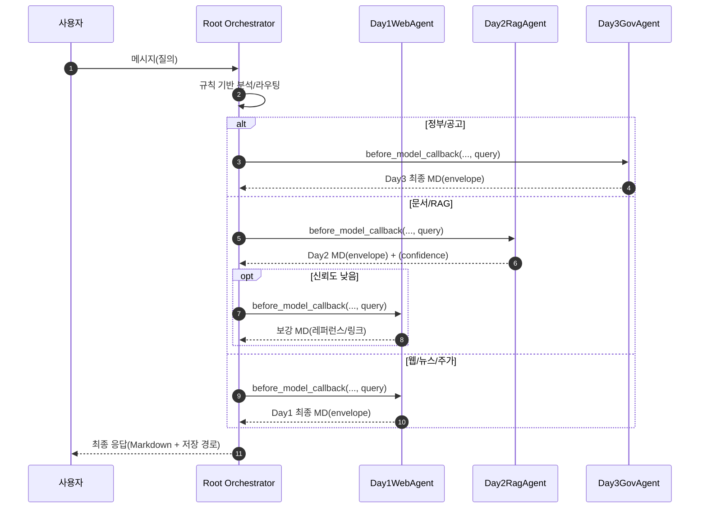

```mermaid
sequenceDiagram
    autonumber
    participant U as 사용자
    participant R as Root Orchestrator
    participant D1 as Day1WebAgent
    participant D2 as Day2RagAgent
    participant D3 as Day3GovAgent

    U->>R: 메시지(질의)
    R->>R: 규칙 기반 분석/라우팅
    alt 정부/공고
        R->>D3: before_model_callback(..., query)
        D3-->>R: Day3 최종 MD(envelope)
    else 문서/RAG
        R->>D2: before_model_callback(..., query)
        D2-->>R: Day2 MD(envelope) + (confidence)
        opt 신뢰도 낮음
            R->>D1: before_model_callback(..., query)
            D1-->>R: 보강 MD(레퍼런스/링크)
        end
    else 웹/뉴스/주가
        R->>D1: before_model_callback(..., query)
        D1-->>R: Day1 최종 MD(envelope)
    end
    R-->>U: 최종 응답(Markdown + 저장 경로)
```